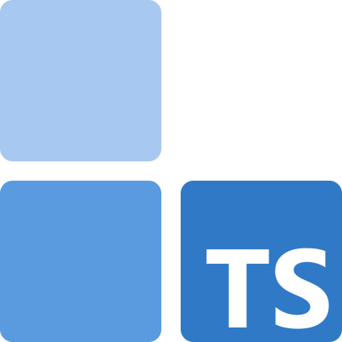

# UniTS

> A collection of type-safe utilities to make your TypeScript projects cleaner, safer, and more composable.

## What is UniTS?

Think of UniTS as your TypeScript toolbox. Instead of reinventing the wheel every time you need to handle errors, validate data, or build complex logic, UniTS provides you with battle-tested utilities that work seamlessly together.

Each package in the UniTS family focuses on solving a specific problem you may encounter as a TypeScript developer.

### [@uni-ts/result](https://uni-ts.dev/docs/result/) — Error Handling

Stop letting errors crash your app unexpectedly. Make them visible in your function signatures and handle them gracefully.

```typescript
import { ok, err, isOk } from '@uni-ts/result';

function divide(a: number, b: number) {
  return b === 0 ? err('Cannot divide by zero') : ok(a / b);
}

const result = divide(10, 2);
if (isOk(result)) {
  console.log('Answer:', result.data); // 5
}
```

### [@uni-ts/model](https://uni-ts.dev/docs/model/) — Data Modeling

Create type-safe data models with related utilities attached. No more guessing if your data is valid or what you can do with it — let TypeScript tell you.

```typescript
import { createModel, type InferModelOutput } from '@uni-ts/model';
import { z } from 'zod';

type Email = InferModelOutput<typeof Email>;
const Email = createModel(z.string().email().brand('Email'));

// TypeScript ensures only valid emails can be passed to this function
function sendWelcomeEmail(email: Email) {}

const input = document.querySelector('input[type="email"]')?.value;
if (Email.is(input)) {
  sendWelcomeEmail(input); // ✅ Safe to use
}
```

### [@uni-ts/composition](https://uni-ts.dev/docs/composition/) — Function Composition

Transform nested function calls into readable, left-to-right pipelines that are easy to understand and modify.

```typescript
import { flow } from '@uni-ts/composition';

const processUserInput = flow(
  validateInput,
  normalizeData,
  saveToDatabase,
  sendNotification,
  formatResponse
);

const result = await processUserInput(userInput);
```

### [@uni-ts/action](https://uni-ts.dev/docs/action/) — Workflow Builder

Build complex workflows from simple, reusable pieces. Perfect for moving repeatable code like authentication, validation, or logging out of your business logic.

```typescript
import { createAction, next } from '@uni-ts/action';

const createPost = createAction<{ title: string; content: string }>()
  .with(validateInput)
  .with(authenticateUser)
  .with(checkPermissions)
  .do(async ({ input, ctx }) => {
    return await savePost({ ...input, userId: ctx.user.id });
  });
```

## Why Choose UniTS?

**🛡️ Type Safety First** — Every utility leverages TypeScript's type system to catch errors at compile time, not runtime.

**🧩 Modular Design** — Install only what you need. Each package works independently but plays nicely with others.

**📚 Proven Patterns** — Based on battle-tested concepts from functional programming that have stood the test of time.

**⚡ Zero Dependencies** — Lightweight packages that won't bloat your bundle size.

**🔄 Works Together** — When you need multiple packages, they integrate seamlessly.

## Documentation

Full project documentation can be found at https://uni-ts.dev.

## License

MIT © [Konrad Szwarc](https://github.com/KonradSzwarc)
